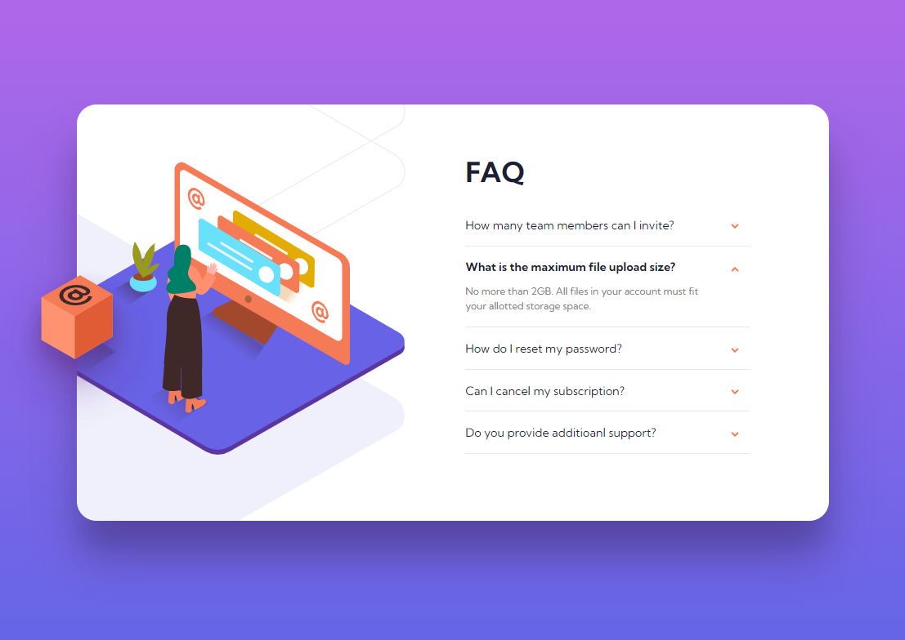

# FM_project_4
# Frontend Mentor - FAQ accordion card solution - CSS only

This is a solution to the [FAQ accordion card challenge on Frontend Mentor](https://www.frontendmentor.io/challenges/faq-accordion-card-XlyjD0Oam). 

## Table of contents

- [Overview](#overview)
  - [The challenge](#the-challenge)
  - [Screenshot](#screenshot)
  - [Links](#links)
  - [Built with](#built-with)
  - [What I learned](#what-i-learned)
  - [Continued development](#continued-development)
  - [Useful resources](#useful-resources)
- [Author](#author)

## Overview

### The challenge

Users should be able to:

- View the optimal layout for the component depending on their device's screen size
- See hover states for all interactive elements on the page
- Hide/Show the answer to a question when the question is clicked

### Screenshot





### Links

- Solution URL: [Add solution URL here](https://your-solution-url.com)
- Live Site URL: [Add live site URL here](https://your-live-site-url.com)

### Built with

- Semantic HTML5 markup
- CSS
- Flexbox
- Mobile-first workflow

### What I learned

1. more practice on flexbox.

2. transition-property and transition-duration combo can give different attribute their own transition duration.

3. learned how to create dropboxes with checkbox input.

4. findout how to prevent elements that got transition attruibute showing animation during different screensize layout changes. 

5. understand how width and max-width combo work together.

6. better understanding on how selectors work, and how to combine them.


##Snippets, see below:

- what I learned #2
```css
.at_box {
        transition-property: right, opacity;
        transition-duration: 0.6s, 0s;
    }
```

- what I learned #4
```html
<div class='pos'>
  
</div>
```

- what I learned #5
```css
.white_bg {
        position: relative;
        top: -18px;
        width: 920px;
        max-width: 90vw;
        height: 510px;
}
```

- what I learned #6
```css
input:checked ~ .pos .block5_arrow {
    transform: rotate(-180deg);
}
```

### Continued development

Going to redo the page with javascrtip controlling the dropboxes, and try to find out how to uncheck checkboxes without javascript.

### Useful resources

- [toggle buttons](https://www.w3schools.com/howto/howto_css_switch.asp) - This helped me learned how to create the dropbox interaction. 
- [selector reference](https://www.w3schools.com/cssref/css_selectors.asp) - This helped me better understand seletors and how to combine them.

## Author

- Frontend Mentor - [@Shawn8z](https://www.frontendmentor.io/profile/Shawn8z)
